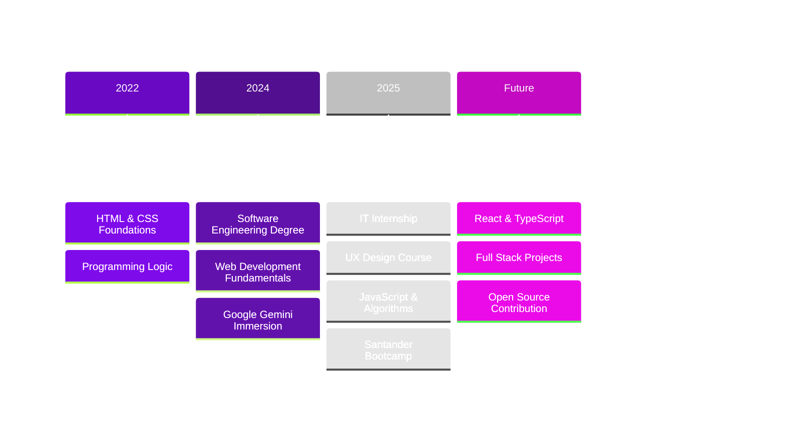

<div align="center">

# Ariane Archanjo


```
Transforming ideas into intuitive interfaces
Curitiba, PR • 18 years old
```


</div>

## About Me

```typescript
const developer = {
  name: "Ariane Archanjo",
  role: "Front-End Developer & IT Intern",
  education: "Software Engineering @ UniBrasil",
  location: "Brazil",
  focus: ["Web Development", "UX Design", "Clean Code"],
  currentlyLearning: ["React", "TypeScript", "Design Systems"],
  philosophy: "User experience is everything"
};
```

Currently working as IT Intern at Cidade Júnior, where I develop web interfaces, maintain databases, and contribute to system improvements. My focus is on creating digital experiences that are both functional and beautiful.

## Tech Stack

<div align="center">

### Core Technologies


<br/><br/>


</div>

## What I'm Working On

<table>
<tr>
<td width="50%">

### Front-End

```css
.skills {
  languages: HTML5, CSS3, JavaScript;
  focus: responsive-design, accessibility;
  tools: VSCode, Git, Figma;
  learning: React, TypeScript;
}
```

Building semantic, responsive interfaces with clean code and attention to user experience.

</td>
<td width="50%">

### Backend & Tools

```javascript
const experience = {
  backend: ["C#", "SQL", "Database Management"],
  tools: ["Git", "VSCode", "Figma"],
  concepts: ["OOP", "Clean Code", "Algorithms"],
  practices: ["Version Control", "Problem Solving"]
};
```

Working with databases, system integration, and backend logic to build complete solutions.

</td>
</tr>
</table>

## Learning Path



## GitHub Stats

<div align="center">
  
  
</div>

<div align="center">
  


</div>

## Experience Highlights

**IT Intern @ Cidade Júnior** • May 2025 - Present

Working on full-stack development with emphasis on front-end, database management, and system optimization. Contributing to financial module improvements and providing technical support.

**Key Projects & Achievements**
- System interface development and optimization
- Database queries and maintenance
- Financial module process improvements
- Technical problem-solving and support

## Education & Certifications

**Software Engineering** • UniBrasil • 2024-2028

**Selected Certifications** (400+ hours)
- Santander Front-End Bootcamp (DIO)
- UX Design (Alura + Santander)
- Web Development Fundamentals (IBM SkillsBuild)
- JavaScript & Algorithms (Curso em Vídeo)
- HTML5 & CSS3 (Alura, Curso em Vídeo)
- Technology Administration (182h)

## Notable Achievements

| Year | Achievement |
|:-----|:------------|
| 2019, 2022, 2023 | OBMEP - Honorable Mentions |
| 2025 | Class Representative - Software Engineering |
| 2024 | Google Gemini Dev Immersion (Alura) |
| 2025 | Data Immersion with Python (Alura) |

## Let's Connect

<div align="center">

[](https://www.linkedin.com/in/ariane-archanjo/)
[](https://github.com/arianearchanjo)
[](mailto:ariane.archanjo1@gmail.com)

<br/>


<br/><br/>

*"Clean code, great design, amazing experiences"*


</div>
