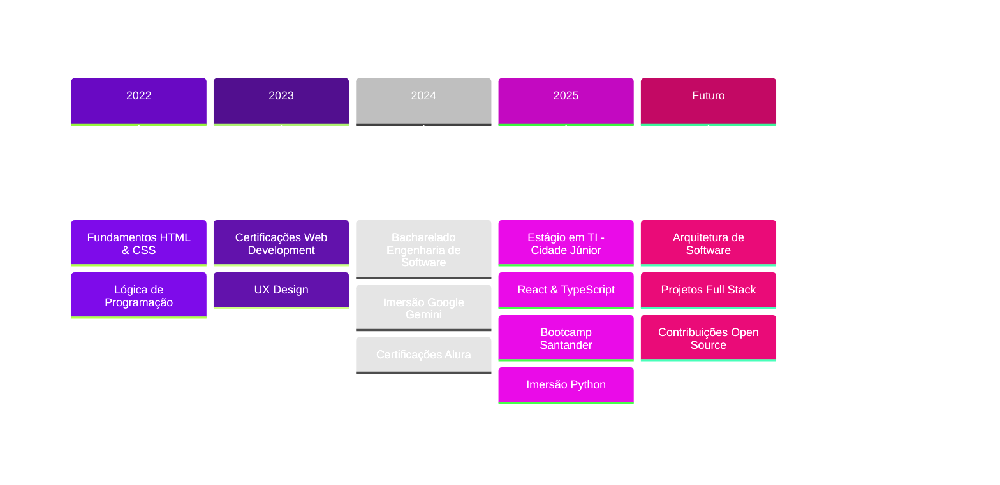
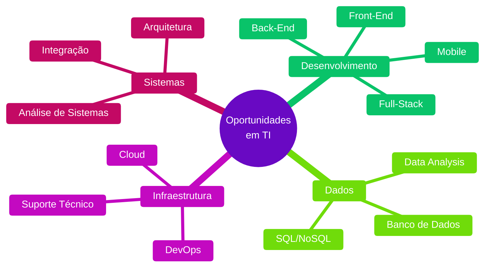

<div align="center">

# Ariane Archanjo


```
Desenvolvendo soluções tecnológicas completas
Curitiba, PR • 19 anos
```


</div>

## 👩‍💻 Sobre Mim

```typescript
const developer = {
  name: "Ariane Archanjo",
  role: "Software Engineering Student & IT Intern",
  education: "Software Engineering @ UniBrasil",
  location: "Curitiba, PR - Brazil",
  areas: [
    "Software Development", 
    "Databases", 
    "Infrastructure", 
    "Systems Analysis"
  ],
  technologies: [
    "HTML", "CSS", "JavaScript", 
    "React", "Angular", "TypeScript",
    "SQL", "PostgreSQL", "C", "C#"
  ],
  currentlyLearning: [
    "Software Architecture", 
    "Scalable Solutions", 
    "UI/UX Design"
  ],
  seeking: "Oportunidades de estágio em Tecnologia"
};
```

Estagiária de TI na Cidade Júnior, com experiência prática em **desenvolvimento de software**, **banco de dados** e **manutenção de sistemas**. Trabalho com desenvolvimento Front-End, integração de APIs, criação e análise de consultas SQL, documentação técnica e suporte a equipes de desenvolvimento.

🎯 **Busco oportunidades de estágio em Tecnologia** nas áreas de desenvolvimento de software, banco de dados, infraestrutura, análise de sistemas ou outras áreas relacionadas a TI.

## 🛠️ Tech Stack

<div align="center">

### Tecnologias Principais


<br/><br/>


</div>

## 💼 Áreas de Atuação

<table>
<tr>
<td width="50%">

### Front-End Development

```css
.skills {
  languages: HTML5, CSS3, JavaScript;
  frameworks: React, Angular;
  tools: TypeScript, Figma;
  focus: responsive-design, 
         UI/UX, accessibility;
}
```

Desenvolvimento de interfaces responsivas e intuitivas com código limpo e atenção à experiência do usuário.

</td>
<td width="50%">

### Backend & Database

```javascript
const experience = {
  databases: ["PostgreSQL", "SQL"],
  backend: ["C#", "API Integration"],
  practices: [
    "Query Optimization",
    "Database Maintenance",
    "System Documentation"
  ]
};
```

Trabalho com bancos de dados, consultas SQL, integração de sistemas e manutenção de aplicações.

</td>
</tr>
<tr>
<td width="50%">

### Infrastructure & Tools

```python
tools = {
    'version_control': ['Git', 'GitHub'],
    'methodologies': ['Scrum', 'Agile'],
    'practices': ['Code Review', 'Documentation']
}
```

Experiência com versionamento de código, metodologias ágeis e boas práticas de desenvolvimento.

</td>
<td width="50%">

### Systems Analysis

```sql
-- Database Queries & Analysis
SELECT skill, experience_level
FROM technical_skills
WHERE area IN (
  'System Maintenance',
  'Technical Documentation',
  'Requirements Analysis'
);
```

Análise de sistemas, documentação técnica e suporte ao desenvolvimento de soluções escaláveis.

</td>
</tr>
</table>

## 📈 Jornada de Aprendizado



## 📊 GitHub Stats

<div align="center">
  
  
</div>

<div align="center">
  


</div>

## 💼 Experiência Profissional

**Estagiária de TI @ Cidade Júnior** • Maio 2025 - Dezembro 2025

Atuação com foco em banco de dados e apoio ao desenvolvimento de sistemas, incluindo:

- 🔍 Manutenção de rotinas internas e sistemas
- 💾 Criação e análise de consultas SQL (PostgreSQL)
- 📝 Documentação técnica de processos e sistemas
- 🤝 Suporte às demandas da equipe de desenvolvimento
- ⚙️ Contribuição para estabilidade e evolução dos sistemas

## 🎓 Formação Acadêmica

**Bacharelado em Engenharia de Software**  
UniBrasil Centro Universitário • Março 2025 - Dezembro 2028

**Capacitação Profissional em Administração com ênfase em Tecnologia**  
Universidade Positivo • Dezembro 2023 - Outubro 2025

### Certificações Principais (400+ horas)

- ✅ Bootcamp Front-End - Santander + DIO
- ✅ UX Design - Alura + Santander  
- ✅ Fundamentos de Desenvolvimento Web - IBM SkillsBuild
- ✅ JavaScript & Algoritmos - Curso em Vídeo
- ✅ HTML5 & CSS3 Avançado - Alura
- ✅ Versionamento de Código com Git e GitHub
- ✅ Administração em Tecnologia (182h)

## 🏆 Conquistas & Reconhecimentos

<table align="center">
<tr>
<td align="center">

**🥉 OBMEP**  
Menções Honrosas  
2019, 2022, 2023

</td>
<td align="center">

**👥 Representante de Turma**  
Engenharia de Software  
2025

</td>
<td align="center">

**🤖 Imersões Tech**  
Google Gemini (2024)  
Python & Data (2025)

</td>
</tr>
</table>

## 🎯 Áreas de Interesse para Estágio

<div align="center">



</div>

## 📫 Vamos Conectar?

<div align="center">

[](https://www.linkedin.com/in/ariane-archanjo/)
[](https://github.com/arianearchanjo)
[](mailto:ariane.archanjo1@gmail.com)

<br/>


<br/><br/>

### 💡 *"Código limpo, soluções eficientes, aprendizado constante"*


</div>
