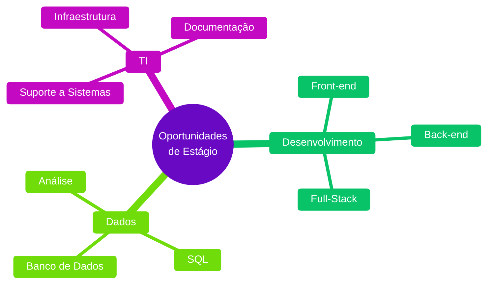

<div align="center">

# Ariane Archanjo


```
Estudante em busca de estágio em tecnologia
Curitiba, PR • 19 anos
```


</div>

## 👋 Sobre Mim

```typescript
const developer = {
  name: "Ariane Archanjo",
  role: "Estudante de Engenharia de Software",
  education: "Engenharia de Software @ UniBrasil",
  location: "Campina Grande do Sul, PR - Brazil",
  experience: "Estagiária de TI @ Cidade Júnior",
  areas: [
    "Desenvolvimento Front-end", 
    "Banco de Dados", 
    "Suporte a Sistemas"
  ],
  technologies: [
    "HTML", "CSS", "JavaScript", "React",
    "C", "C#", "SQL", "PostgreSQL",
    "Git", "GitHub"
  ],
  currentlyLearning: ["Python", "Estruturas de Dados"],
  seeking: "Oportunidades de estágio em Tecnologia"
};
```

Sou estudante de **Engenharia de Software** e estou em busca de oportunidades de **estágio em tecnologia** onde eu possa aplicar o que aprendi, evoluir tecnicamente e contribuir com projetos reais.

Tenho experiência prática com **desenvolvimento front-end**, **banco de dados** e **suporte a sistemas**. Gosto de resolver problemas com lógica e código, e aprendo rápido quando tenho um objetivo claro.

🎯 **Busco oportunidades de estágio** nas áreas de desenvolvimento de software, banco de dados ou outras áreas relacionadas a TI, onde eu possa aprender com profissionais experientes e contribuir desde o primeiro dia.

## 🛠️ Tecnologias e Ferramentas

<div align="center">

### Stack Técnico


<br/><br/>


</div>

## 💡 Como Eu Trabalho e Aprendo

<table>
<tr>
<td width="50%">

### Organização

```javascript
const workStyle = {
  code: "limpo e documentado",
  versionControl: "Git e GitHub",
  focus: "entender o contexto",
  approach: "resolver por partes"
};
```

Gosto de manter código organizado, versionado corretamente e bem estruturado.

</td>
<td width="50%">

### Aprendizado Prático

```python
learning = {
    'method': 'fazendo projetos',
    'mindset': 'constância e foco',
    'skills': [
        'raciocínio lógico',
        'resolução de problemas',
        'aprendizado rápido'
    ]
}
```

Aprendo melhor colocando a mão na massa e resolvendo problemas reais.

</td>
</tr>
<tr>
<td width="50%">

### Responsabilidade

```sql
SELECT competencia 
FROM soft_skills
WHERE tipo IN (
  'cumprimento de prazos',
  'busca por contexto',
  'disposição para aprender'
);
```

Busco entender as tarefas, cumprir prazos e pedir ajuda quando necessário.

</td>
<td width="50%">

### Pensamento Lógico

```css
.problem-solving {
  approach: break-down-complexity;
  method: step-by-step;
  focus: logical-reasoning;
  result: clean-solutions;
}
```

Facilidade para quebrar problemas complexos em partes menores e resolvê-los.

</td>
</tr>
</table>

## 💼 Experiência Profissional

**Estagiária de TI @ Cidade Júnior** • Maio 2025 - Dezembro 2025

Atuação com foco em banco de dados e apoio ao desenvolvimento de sistemas:

- 💾 Criação, análise e manutenção de consultas SQL em PostgreSQL
- ⚙️ Apoio ao desenvolvimento e manutenção de sistemas internos
- 📝 Elaboração de documentação técnica para rotinas e processos de TI
- 🤝 Suporte às demandas da equipe de desenvolvimento
- 🔧 Utilização de Git e GitHub para versionamento de código
- 🎯 Contribuição para a estabilidade dos sistemas

## 📂 Sobre Meus Projetos

Os repositórios aqui representam minha jornada de aprendizado em desenvolvimento de software. Cada projeto tem um propósito claro: aplicar conceitos de programação, testar tecnologias ou resolver problemas de forma prática.

Alguns foram desenvolvidos na faculdade, outros por iniciativa própria para consolidar conhecimentos e evoluir tecnicamente.

**Se você é recrutador**, fique à vontade para explorar os repositórios e entender como penso e codifico.

## 📈 GitHub Stats

<div align="center">
  
  
</div>

<div align="center">
  


</div>

## 🎓 Formação Acadêmica

**Bacharelado em Engenharia de Software**  
UniBrasil Centro Universitário • Março 2025 - Dezembro 2028

**Capacitação Profissional em Administração com ênfase em Tecnologia**  
Universidade Positivo • Dezembro 2023 - Outubro 2025

### Certificações Relevantes

- ✅ Versionamento de Código com Git e GitHub
- ✅ Técnicas de Engenharia de Prompt
- ✅ Fundamentos de Inteligência Artificial
- ✅ Fundamentos de LLM
- ✅ Introdução ao HTML na Prática
- ✅ HTML5 e CSS3 Avançado
- ✅ Letramento Digital

## 🎯 O Que Estou Buscando

<div align="center">



</div>

Estou em busca de uma **oportunidade de estágio em tecnologia** onde eu possa:

- 🚀 Trabalhar com tecnologias modernas e aprender com profissionais experientes
- 💼 Contribuir com entregas reais, mesmo sendo iniciante
- 📚 Evoluir tecnicamente em um ambiente que valorize aprendizado contínuo
- 🎯 Aplicar minha lógica, organização e comprometimento em projetos reais

## 📫 Vamos Conversar?

<div align="center">

[](https://www.linkedin.com/in/arianearchanjo/)
[](https://github.com/arianearchanjo)
[](mailto:ariane.archanjo1@gmail.com)

<br/>


<br/><br/>

### 💙 Obrigada por visitar meu perfil!

Estou sempre aberta a feedback, conexões e oportunidades de aprendizado.

### 💡 *"Aprender fazendo, evoluir constantemente, entregar com qualidade"*


</div>
